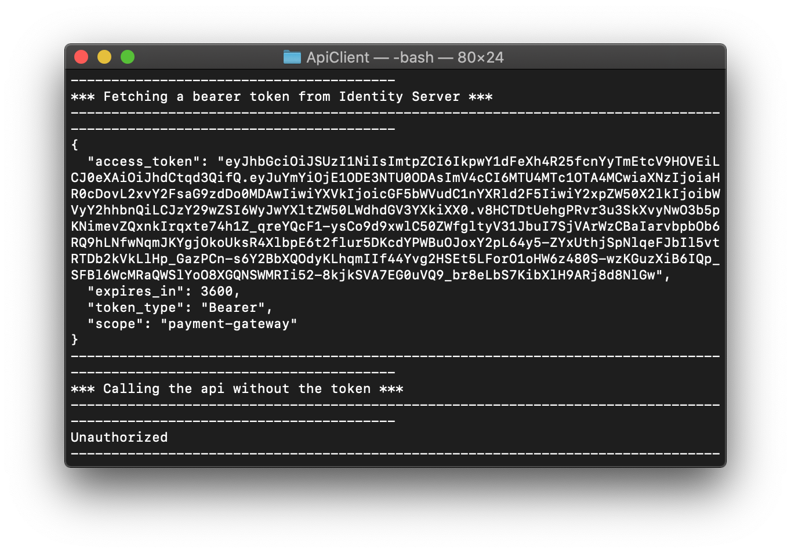
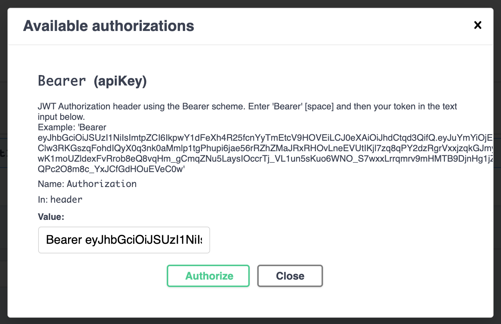
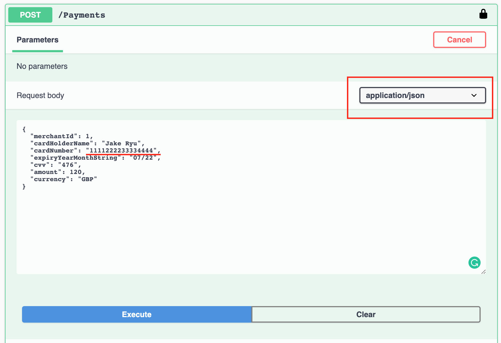
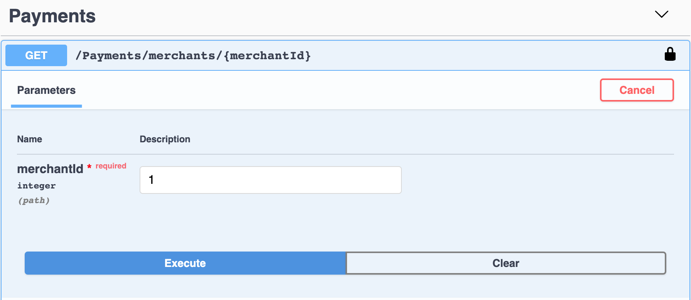
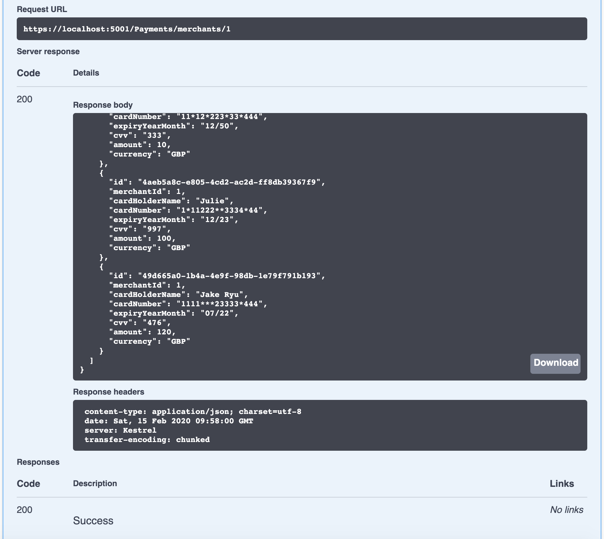

### Development Scope

Build an API that allows a merchant to process a payment through the payment gateway, and to retrieve details of a previously made payment.

### How to run
The target framework is netcoreapp3.0. To run the solution, download and install .NET Core SDK v3.0.0 or later at https://dotnet.microsoft.com/download/dotnet-core/3.0
PowerShell is also required.
 
 Open PowerShell as administrator as writing permission is needed for a local database and logging. For MacOS, run 
 ```
 sudo pwsh
 ```
 
 Change directory to `Build` and run 
 ```
 ./build.ps1
 ``` 
 
 It invokes,
 
 1. Build the entire solution
 2. Migrate database
 3. Run test projects
 4. If the tests pass, run API
 
The API is listening on http://localhost:5000, https://localhost:5001
 
Note: If run into a permission error like "Can't write to SQLite ...", make sure the terminal is run as Admin privilege.

### Give it a try
The API are up and running if you have run the PowerShell script `build.ps1`. The script does not necessarily run the API but running tests before launching API is the idea.

Once API Swagger is loaded, we need a bearer token, otherwise we get 401 Unauthorised error. To do so, we need to launch IdentityServer to get a token.

- Open a new terminal window. Change director to `IdentityServer` and run
```
dotnet run
``` 

- Open a new terminal window. Change directory to `ApiClient` and run
```
dotnet run
``` 



Copy the value of access_token and put it in Swagger. Hit Authorize button on the top right in Swagger.

Enter the value copied with 'Bearer ' in front. Make sure the Bearer and the token are separated by space as below.

 

Hit Authorise button to close the dialog.

Let's post a payment request. Note that card number, `1111222233334444` is only accepted. Try other number to see if it returns `Bad Request` error.



Finally, we can see the list of payment. Provide the merchant number that was used on posting.




Note that the card number has been masked for security.


- Domain contains entities, value objects, enterprise-wide logic and exceptions
- Application contains interfaces to implement use case scenarios, command / queries, validators, exceptions
- Infrastructure contains all external concerns
- Presentation and Infrastructure depend only on Application
- Infrastructure and Presentation components can be replaced with minimal effort


pplication

### Application logging
Serilog is a choice of logging here. For the test purpose it logs in a file but adding another sink for test and production
environment. It's extremely useful to use a centralised logging. Using a correlation id such as user id to group sequential processes helps track a user journey.
The log files are found in `Logs` directory under the solution root.

MediatR handles all requests and manages the request pipeline. We can log all requests and its performance via MediatR. Refer Application > Common > Behaviors.

### Application metrics

### Containerisation

### Authentication

IdentityServer 4

### API Client

### Build script / CI

PSake

### Performance testing

### Encryption

### Data Storage

SQLite

